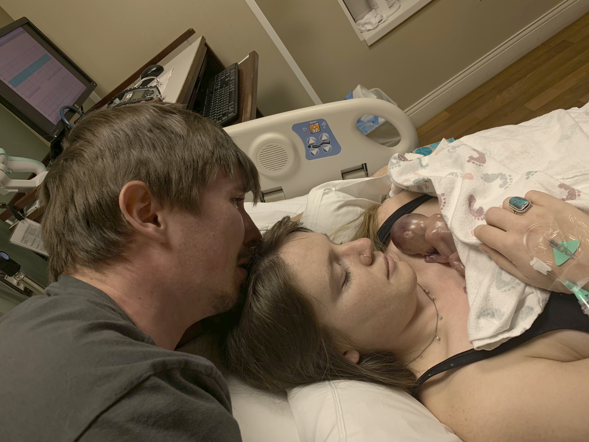
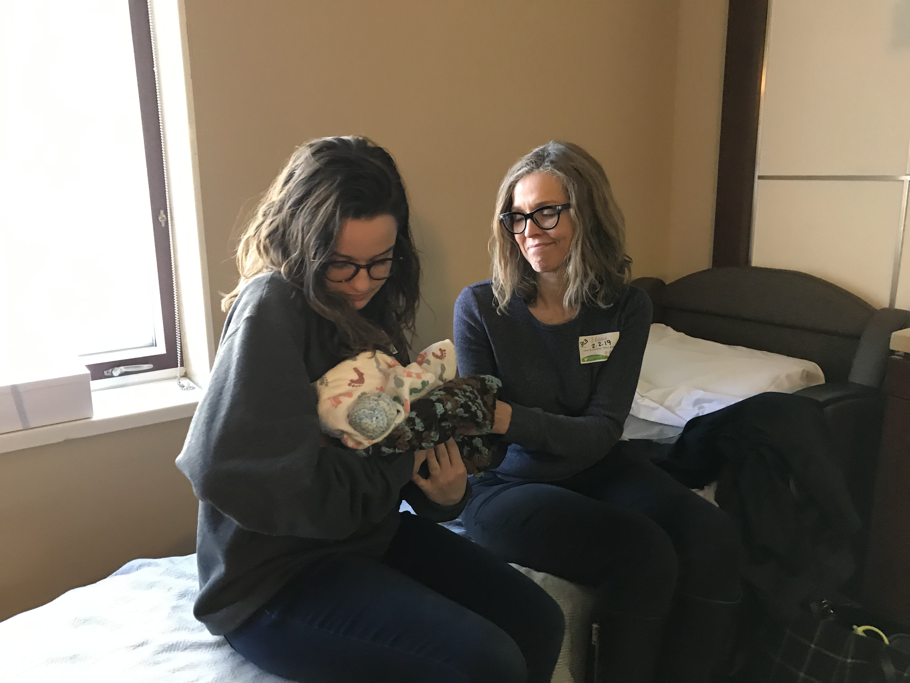
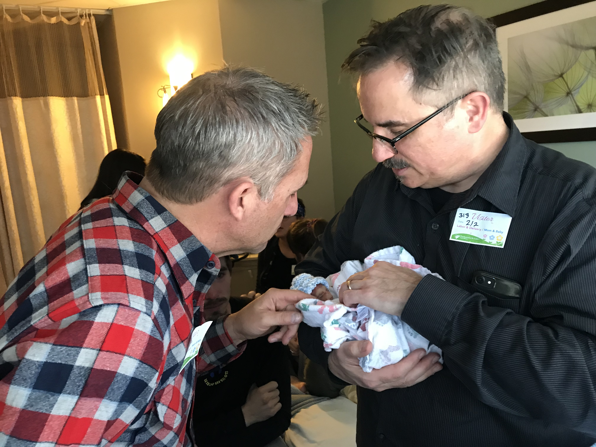
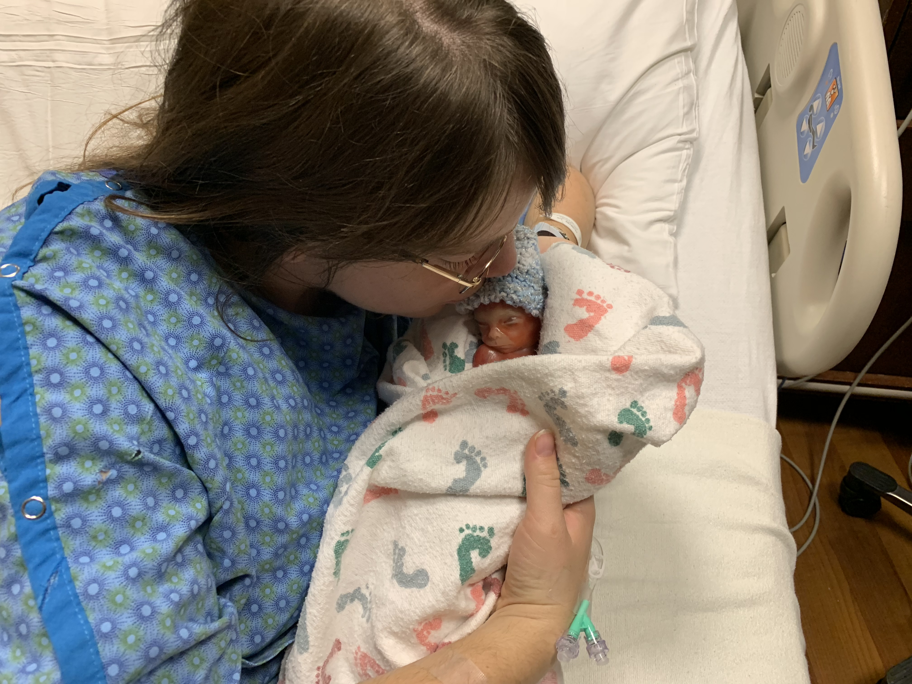

### The day you were born.
February 1st started off like almost any other Friday recently. I woke up at 5:30am to get ready for work and made it to the office around 7am. There was a party at the office around noon, and my plans were to enjoy some time with the people there, and head to Denver to spend the weekend with your mom. Up until this point, I've been afraid of telling people about you. I've been afraid of the possibility of losing you. I didn't want to have to tell people who were excited to meet you, that the wouldn't get the chance.

That day was different. I felt encouraged by all of the doctors who told us that you were perfect, and everything looked fine. I beamed about you to some of my co-workers at that party for the first time. I told everyone how excited I was to be a father. It felt good to tell people about you.

I left the office around 2pm and made it to the hotel around 3:30pm. Your mom looked beautiful waving at me from across the street. I gave her a kiss and after that she told me that she had been feeling what she believed to be [Braxton Hicks contractions](https://en.wikipedia.org/wiki/Braxton_Hicks_contractions). She was in Denver for an All State Choir event, and had to sing at a special performance for directors. I brought my things up to the hotel room, and that's when your mom said: "I can feel him moving!". I got to feel your tiny kick through your mothers belly for the first time, and I almost cried with excitement. You were such a ball of energy in there.

We left the hotel and went to the singalong. Your mom was still feeling the contractions. The performance was beautiful. 10 floors of kids singing from balconies. I know now that they were singing the celebration songs of your arrival into our arms. Your mom looked miserable when she met me after the concert, she knew that she had to go to a hospital. On the way back to the hotel, she keeled over in the street clutching her belly in pain. We knew that we had to get to the hospital fast, but still didn't know if this was just some early pains that were natural and part of the process. We told the valet that your mom was in labor and we needed the car as quickly as possible. They ran to the lot to get it and we were out of there and on the way to the hospital. On the way your mom kept saying: "Baby, why do you want to come now?".

### When we got to the hospital.
I helped your mom walk into the emergency room around 7:00. We explained to the nurses that you felt like you were having contractions, and that you might be going into labor. They asked how many weeks pregnant she was, and she replied "19". The nurse told us that tonight we would be "20 weeks" since that was the earliest that they could take us into the Labor facility. "You don't want to be in an emergency room, you want to be upstairs" the nurse told us.

A nurse pushed your mom in a wheelchair for what seemed like a mile to get to the Labor center. We were in the hospital room within about 10 minutes of getting to the hospital. They had you into a bed and started to ask your mom question after question. "How long have you felt this?", "Have you been drinking water?", "When's the last time you pooped?". Your mom has gone to the hospital on several different occasions for several different pains, that have ended up being some feces in her bowels. I was really hoping that the end of this story could be: "That was the third time I took Dani to an ER where a doctor told her she was full of crap." This time was different, because she was full of you, and we were both full of love for you.

Several nurses were in the room trying to gather as much information as they could about your mom. Some of them were convinced that she was dehydrated and that it was the dehydration that was making her feel contractions. She explained that she felt like she needed to go to the bathroom really bad, and they told her she should try. When she came out of the bathroom she had a worried expression on her face and said: "Something's coming out". They pulled an ultrasound machine into the room to examine you. "They're perfect. Do you want to know the gender?" We were scheduled to find out in a few weeks but wanted to know now. "It's a boy".

The nurses had her get on the bed and brought a light in to examine. I wanted to see what was coming out, and sure enough, a small green bag was beginning to protrude. The nurses confidence that everything was going to be okay disappeared almost immediately after seeing that. She told us: "Sweetheart that looks like your bag. We need to get a specialist in here". They hooked your mom up to an IV and began to draw blood to test for infections. They inverted your mom so that they could hopefully have gravity coax her amniotic sac back inside to prevent it rupturing. The doctor rushed in and said that she needed to confirm that there were no infections before starting any sort of procedure to get the sac back inside.

They told her to take deep breaths and hang tight while they made the necessary preparations. Everyone left the room and for a while it was just me and your mom. I encouraged her that everything was going to be fine and that all of the nurses and doctors were doing everything they could to make sure that you and her would be safe. Your mom suddenly felt another contraction come on and said that we needed to get nurses in the room quickly. We called a nurse in and she inspected the sac again to make sure it was still intact, before leaving one more time. Your mom was calm for a little while longer, and then she felt another rush of pain and said again: "Get someone in here". We called the nurse again, and this time, all of the nurses and the doctor came back in. "We're still waiting on results to begin this operation, your doing great, and everything is going to be fine." They offered her a drug to ease the pain, Fentanyl. She accepted it and as they were administrating it told her that she might feel dizzy. The drug seemed to calm her down a bit and the doctor and nurses were still urging her to stay calm and wait for the results. Suddenly, there was a sound of popping and a splash of liquid as your mom's water broke. 

### When you were born

Up until this point I had stayed hopeful. My hope was that they could find a way to make sure that you stayed inside the womb. When your mom's water broke, almost all of that hope was gone. I had just a sliver of optimism as the doctor told us "This is it. You're having this baby, and that means that it will not live. I'm sorry." Even the nurses words couldn't deplete that last bit of hope that maybe they were wrong, and maybe this was just some sort of misunderstanding. Maybe your mom had two water bags for some reason. Maybe you could be born tonight, and they could save you some how. Nothing could've prepared me for what happened next. Your mom cried out and there was a loud pop and a thud as you exploded out onto the table. That noise, was like a gunshot from a gun pointed at my heart, my hope, and everything that is good in my life. I was shattered in to billions of pieces. The last sliver of hope disappeared along with the hope I had for anything good in this world. 

>I wept harder than I have ever cried in my life. 

It wasn't a wail, but an uncontrollable heaving. My face was buried into your mother's pillow, and my hat fell off of my head. The dreams of holding you in my arms were gone. My imagination of you experience life for the first time was replaced with a feeling of wishing my life had never happened. I thought it would never end. It was truly the most pain, I've ever experienced in my entire life. 

You were born at 8:05pm in St. Luke's hospital on February 1st, 2019.

### After you were born.
I never thought anyone was ready to be a parent. I thought that I would really never be ready, and that this feeling of being unprepared was just part of having children. Any fear I had, or feeling of not being ready dissolved the moment I saw your face for the first time.

"He's perfect, and he's yours to be with tonight". Through my tears and heaving I looked down to see my incredible son pressed against the bosom of his mother. The structure of your tiny body resembled mine so much, it was as if I was looking at a miniaturized version of myself. You were almost 10 inches tall. I couldn't believe how much you had grown in the few months since we found out that we were expecting you.

We named you "Charles Thomas" after your two great grandfathers: Charles Bovee, and Thomas Darr. These two men are strong warriors like you, and the name suited you perfectly, because just like them, you're a strong warrior.

In between crying I held your hand on the tip of my finger. Your tiny fingers were incredible to behold. Miniature versions of my hands. You were kicking and squirming every little while. It was such a beautiful site to behold, but was also sad, as I knew these were kicks meant to develop your reflexes in the womb and not meant for the air of the earth. You were lying sideways pressed into your mom, your tiny feet were crossed and you were so peaceful. I couldn't believe how peaceful you were. You opened your mouth and lifted your chest as if to take a huge breath. "He just took a breath" your mom would say to me. I was deeply troubled by the fact that this wasn't you taking a deep breath, but attempting to breathe into lungs that were not yet developed. Each time you tried to take a breath, I was filled with even more sorrow. Life is so resilient, that even with the incomplete body you were born with, you fought hard to stay alive. I could see your tiny heart beat in your tiny neck beating slower and slower.

Your mom and I took turns holding you, trying to take in as much of this precious time as we could. When I held you it felt like I was holding a little furnace. So much heat and energy and life in one little ball. I touched your tiny body as much as I could, and gave you so many kisses. You were bathed in my tears. It wasn't fair. 

The chaplain came in and guided me through your baptism. She had forgotten the cup of water and as she went to get it I held your precious body and the palm of my hand, and thought about how much I wanted the best for you. When she came back in she lead us in prayer and I got to take small drops of water and "In the name of the father" baptise you. You kicked your legs for the last time I can remember as I made a tiny cross on your chest with the water. I knew that soon you would be in heaven with your uncles.

### After you went to heaven.

It was hard to tell, because your heartbeat hadn't stopped abruptly but seemed to slow down. We think that you left this world sometime between 9:45 and 10:15, though it was really difficult to say.  We continued to take turns holding you and studying every precious detail on your tiny body. Your hands, feet, knees, neck, shoulders, bottom, head, face, eyelids, fingers, and tiny fingernails. You were so precious an so perfect. I couldn't stop crying. A nurse came in around 11 and confirmed that you had passed, and took you out of the room to prepare a small memory box with pictures and keepsakes that we could look at and remember you by.

We called your grandparents to let them know. We could've filled up a pool with the amount of tears that we all cried for you that night.

Eventually you were brought back into the room in a tiny little bassinet with a cute little hat and blanket. We got to hold you and take pictures of you in your cute outfit until the family members started to arrive.

### The night you met Nonnie, Pops and Zoe

Your Grandpa "Pops", and Grandmother "Nonnie", along with your Aunt Zoe, came to the hospital around 12:30. Pops and I hugged and sobbed into one another as we both processed the situation. Nonnie wept along with Zoe and Dani on the hospital bed. Eventually they all gathered around your crib to take in the magnificence of your precious face. They would take turns holding you, and your mom and I did our best to explain the events that had taken place that evening. After an hour or two of this time, I went with your family back to the hotel that Dani and I were planning on staying in. I helped them get the car into the Valet, and went with them up to the room to collect all of your mothers things.

### Understanding what tragedy means
In the silence of the elevator ride I thought about how different life was just a few hours earlier. My dreams for this weekend. My dreams for this month. My dreams for your first year. As I collected all of your mothers things from the hotel room, the reality set in that our life would never be the same, or even close to the way we dreamed it would be. For as long as I could think, I believed that a crime was any action by someone that effected someone else negatively. That night I learned a definition for a tragedy. A tragedy can be experienced by more than one person and is the result of an event that permanently removes one's ability to dream in specific areas of their life. There are very few things that fit this category. 

I'm a firm believer that life is full of opportunity, and that if you don't see it right away, you might find an amazing opportunity that others missed. To me, as long as there is life, the world is full of opportunity. For some people there is less opportunity, but there is still some there. I think that the only time opportunity disappears, is when someone dies. When we die, we can't have opportunities, at least in the way that we understand them in this life. When someone else dies, we lose any chance of opportunity to experience life with them. Or at least we lose the opportunity to experience this life with them. When you passed away, my dreams for your life were gone, and I understood what a tragedy is.

I left the hotel and drove back to the hospital. I got lost on the way due to my exhaustion and also due to the fact that whoever designed the street layout for the city of Denver must also be responsible for designing some level of hell.

When I got back, your mom was asleep and there was a fold out bed with sheets all ready for me to try and sleep in. I picked you up and held you for a little while longer before I tucked in for the night. I knew that the time to see your perfect figure was slowly dwindling and I wanted to take in as much as I could possibly get before I had to say goodbye. I kissed you on the forehead and placed you gently back into your crib. As I drifted off to sleep I thought about all of the times people have told me about wanting to wake up from a bad dream. For a long time, I've never really minded nightmares. I couldn't tell you why, but I've never really thought of them as something I've felt like I had to wake up from. To me nightmares are fun. You experience something awful and when you wake up, you think about how glad you are that you aren't living in that reality.

>When I got the papers for your birth certificate and death certificate, I knew that for the first time my reality was a nightmare that I never wanted to wake up for.

### When you met Gigi, Noe, Rachel, and Bri
Your Grandma "Gigi" made it to the hospital around 5:30 am on Saturday. She and I hugged and cried for a while, and then she hugged your mom and cried for a while. She covered her face when she saw you in the crib for the first time, and cried some more. "He's perfect, He's having so much fun with Grandpa Don right now", she said. I climbed into the hospital bed, and tried to get a little more sleep in occasionally peering through my tired eyelids to see Gigi rocking you and loving you. across the room. 

A nurse came in and explained encouraged your mom that everything that happened was not her fault, and that there was know way for her to know that this was going to happen. She told us about her child that had passed 30 years prior, and how the grief never goes away, but that overtime it gets easier. She was so kind, and we were so thankful for her words.

Nonnie, Pops and Zoe came shortly afterwards with coffee, and there was more hugging and crying as the two grandmothers embraced for the first time since they received news of what had happened. After a while your aunt Rachel came and cried while holding you in her arms.
A little while later your aunt Noelle, showed up and wept into your basinet. We were all feeling emotionally and physically exhausted.

We had a facetime with your aunt Bri who through her tears and sorrow shared beautiful words about you. We held the camera over you for her to see and she started to cry more as she took the site of you in. 

Everyone loved you so much.

### When you met Boompah
Your Grandpa Boompah was having a hard time getting to Denver, as one thing after another seemed to make it harder and harder for him to drive there. He finally made it to Denver around 12:30 and we could hear him already making friends with the whole hospital and saying something funny to the nurse that lead him to the room. When he got in, he dropped his bag, and gave me a hug. The world around me stopped as I sobbed into my dad's shoulder. He held me up as I continued to cry telling him about how amazing you are. I could hear everyone around me weeping and eventually Gigi asked him if he was "ready to meet his grandson". "I don't know if I can" he said as eyes welled up with tears. He walked over to the basinet and stood over you taking you in. I rubbed his back and told him that he should hold him. He mentioned that when he and mom had me he was worried that "my head might roll off", and that he was feeling that a little more so with you cause you were so tiny.

He held you in his arms and asked the question: "What does his life mean? What do you think it stands for." I told him that I believed that your life meant that "there is good in all things."

### There is good in all things.

How do you deal with a tragedy such as this? With dreams shattered, where can you go? Charles Thomas, your life is filled with purpose that we all have to come to terms with in our own way. I believe that your life is a symbol and a reminder that there is good in all things, and that just like you were, those good things can be small and easy to miss. We miss you so much.

With all of the sadness, it doesn't take much to let your emotions go towards feelings of sorrow and anger towards how cruel and unfair life is. Just like we collected the precious moments of time with Charles, I began to collect the small pieces of good that came during an unbearable situation. Here they are:
1. We got to see you.
2. We got to see you moving and alive.
3. We got to hold you while you were alive.
4. Your family got to meet you.
5. Your Boompah was able to meet you in spite of being all of the way in Florida scheduled to fly much later than we would have been with you.
6. Your Boompah made it through all of the traffic and car accidents in time to be with you.
7. Your Nonnie, Pops and Aunt Zoe, all had a place to stay in our hotel room.
8. The hospital was only 5 minutes away.
9. The nurse that helped us at first gave us the helpful tip of saying "20 weeks" that got us into a wonderful birthing center with some of the best doctors in the state.
10. The nurses in the hospital had everything they needed to make a wonderful box of memories for you.
11. The nurses and doctors in the hospital knew exactly how to hold our hearts through the situation.
12. I was there in Denver to be with your mother when you were born.
13. Your mom didn't give birth on the street.
14. Or in the car.
15. Or in the hotel room.
16. Or in some ill-equipped hospital.
17. Your mom didn't have any medical emergency that put her in danger.
18. You were perfect, in all of your tiny details.
19. We got to spend your entire life on earth with you.
20. You heard us tell you how much we love you.
21. You felt our tears as they landed upon you.
22. I was able to be led through your baptism.
23. We received your life as a testament to the truth that there is good in all things.

### When I said goodbye.

We gathered around the bed and everyone joined in prayer for all who were invested and effected by your life. We thanked God for the time with you and the circumstances surrounding that small amount of time with you. One by one your family took your body in their arms and said goodbye to you in their own special way. Your Pops said his goodbye and then delicately placed you back into the crib. Everyone left and it was just us. Your mom took you in her arms one more time and said he last goodbye's. I held you in the palm of my hand and told you the truth: 

"You always were my son, and you always will be my son. This isn't a goodbye to you, but a goodbye to your body which was a beautiful container for your spirit during your short time with us. I love you so much, and look forward to the day that I can hold again".  

I believed all of this, but still it was so hard to say goodbye. I kissed you one more time and placed you back in the crib. We took the hat you were wearing and the blanket around you leaving you swaddled in the hospital blankets. We packed your memories box and gathered the last items from around your room. Then we left.

### Meeting Uncle Nat
Nathaniel Charles met Charles Thomas in spirit when we stopped by the house. It was our final stop for the evening and by this time, we could barely keep our eyes open. I hugged Nat so tightly and wept into his shoulder. Through my tears I whispered into his ears: "Last night you became an uncle, and shortly after, you lost a nephew". You could see in Nat's tearful eyes that he was so sad that he couldn't be there to hold him in person. He shared how sad he was to not be able to be the "fun uncle" for you, and how much he wanted to do fun things with him when he was old enough. We laid the pictures from your memorial box out on the table so he could see how precious you are. "So this is where we all came from" he said as he placed his index finger over the tiny prints left by your perfect hands. "I'm here for you, so if there's anything you need, let me know". It meant so much that we could share this time. I really do think Nat holds a special place in your heart as he is your one and only, and very cool uncle.

### Where do we go from here?

I never thought about funeral homes, and planning memorial services. These seemed like things I would do later in life when my parents pass, or maybe a dear friend. It was so hard to explain to the person over the phone that we needed to setup funeral arrangements for our infant son. 

When I woke up on Friday morning, I thought we'd be helping you learn how to write your name, not writing your name on a death certificate. I thought we'd get to see you struggle to walk for the first time, not struggle ourselves to walk to the car as we left the hospital. I thought you'd be baptized in your Pop's church, not in with the cold hospital water. I thought you'd be with us safely inside your mom's womb while we explored Hawaii in March. I thought you'd get to sleep in the crib we got for you, or ride in the stroller. I thought you'd be in the back seat of our car as we left the hospital instead of us being in the back of your grandparents car as they drove us home. I thought I'd see you grow into a man, instead I look in the mirror and see the man I became the day I lost you. I thought you'd bury me after having a family of your own.

There is good in all things, and for as long as we can, your mom and I will remember you for showing me that. Some day your brothers and sisters will hear your amazing story and eventually we will all be together after we cross through the waters that you crossed the night you were born.

Charles Thomas Bovee, we love you so much and are all so thankful for every single second with you.

-Your Dad.